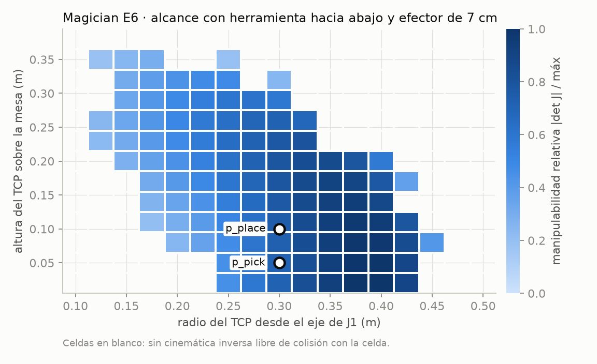
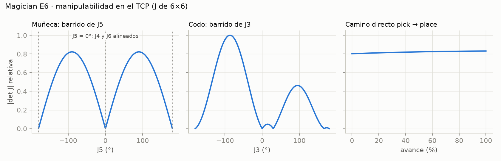

# Paquetes 1.6 y 1.7 — Alcanzabilidad y singularidades del Magician E6

**Fecha:** 2026-09-29 · **Rama:** `feature/magician-e6-evaluacion`
**Código:** `tools/analisis_cinematico_e6.py` · **Figuras:** `results/figures/1.6_alcanzabilidad_e6.png`,
`results/figures/1.7_singularidades_e6.png` · **Datos:** `results/analisis_cinematico_e6.yaml`

Complementan la tabla DH del E6 (1.5) con los dos análisis que se resuelven sobre el modelo.

---

## 1.6 Alcanzabilidad

**Método.** Plano vertical que pasa por el centro de obstrucción (azimut −45°). La rejilla va de
0.10 a 0.50 m de radio y de 0.02 a 0.38 m de altura del TCP. En cada punto se busca una cinemática
inversa **libre de colisión con la celda**, con la herramienta hacia abajo y el efector de 7 cm, y
se registra la manipulabilidad de la solución.



| Resultado | Valor |
|---|---|
| Puntos alcanzables | 105 de 221 |
| Zona de mayor manipulabilidad | Radio 0.35-0.42 m, TCP a 0.02-0.20 m |
| `p_pick` (r = 0.30 m, z = 0.05 m) | Alcanzable, manipulabilidad del 0.71 del máximo del mapa |
| `p_place` (r = 0.30 m, z = 0.10 m) | Alcanzable, 0.74 del máximo del mapa |

Las poses de la tarea están **dentro de la zona fiable, con margen hacia los bordes**. Por debajo
de 0.25 m de radio y cerca de la mesa, el brazo tiene que plegarse contra sí mismo o contra la
mesa y deja de haber solución. Por encima de ~0.43 m se acaba el alcance con la herramienta hacia
abajo.

## 1.7 Singularidades y justificación de Δq

**Método.** Manipulabilidad de Yoshikawa w = |det J|, con J el jacobiano de 6 × 6 en el TCP.
Se calcula al barrer J5 (muñeca) y J3 (codo) desde la configuración media de la tarea, y a lo
largo del camino directo pick → place.



| Singularidad | Dónde | Relevancia para la tarea |
|---|---|---|
| **Muñeca** | J5 = 0° (y ±180°, fuera del rango de ±173°): los ejes de J4 y J6 se alinean | La tarea usa J5 = 90° (herramienta hacia abajo): lejos |
| **Codo** | J3 = 0° (brazo extendido); el barrido muestra además ceros en J3 ≈ 30° y ≈ 167° (este último fuera del rango de ±154°) | La tarea usa J3 entre −111° y −116°: lejos |
| **Camino directo** | Manipulabilidad entre **0.80 y 0.83 del máximo de los barridos** en todo el recorrido | La tarea nominal no cruza ninguna singularidad |

**Por qué la acción es Δq y no cartesiana.**
- Un controlador cartesiano calcula q̇ = J⁻¹ ẋ. Cerca de J5 = 0°, det J → 0 y q̇ diverge para
  cualquier ẋ finita.
- Con acción articular, |Δq| ≤ 0.05 rad por paso **por construcción**, esté donde esté el brazo.
- La política puede acercarse a una singularidad (al rodear un obstáculo, por ejemplo) sin que la
  acción deje de estar acotada. La tarea nominal está lejos de ellas, pero el agente explora y
  puede llegar ahí durante el entrenamiento.

## Reproducir

```bash
.venv/bin/python tools/analisis_cinematico_e6.py        # ~4 s
```
