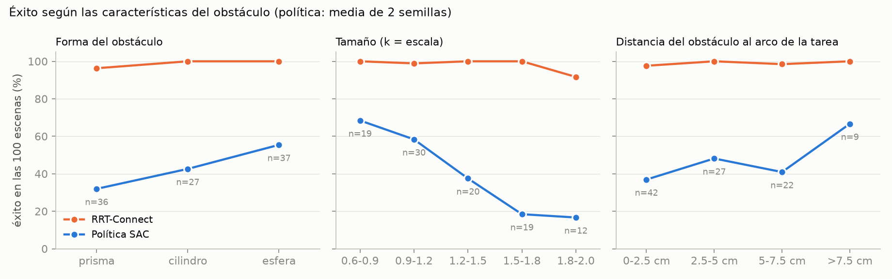
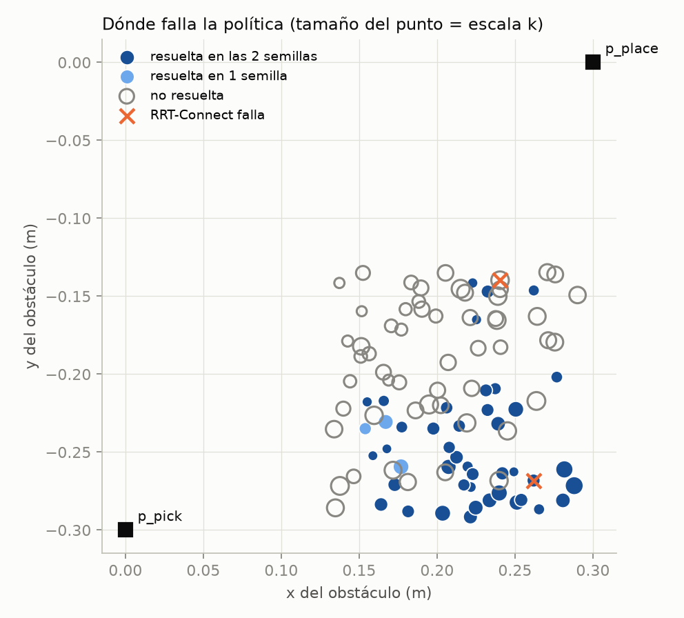
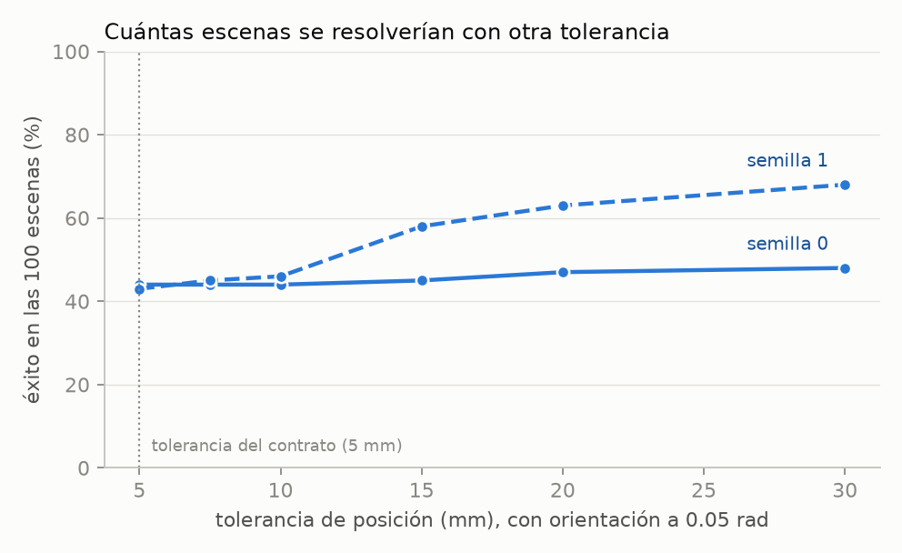

# Las 5 métricas y el análisis de generalización (paquetes 4.1 y 4.3)

**Herramienta:** `tools/analisis_generalizacion.py` · **Datos:** `results/analisis_generalizacion/` ·
**Figuras:** `results/figures/4.3_*.png`

Política evaluada: SAC con la recompensa v1 y la aceleración acotada, 1 M de pasos, **2 semillas**
(0 y 1). Línea base: RRT-Connect (3 consultas por escena) y LazyPRM\* (1 consulta por escena). El
conjunto de evaluación son las 100 escenas fijas; el contrato son las 19 variantes.

## 1. Las 5 métricas, para ambos métodos

**Conjunto de evaluación (100 escenas):**

| Método | M1 éxito (IC 95 %) | M2 episodios con colisión | M3 cartesiana / articular (mediana) | M4 cómputo (mediana) | M4 ejecución | M5 holgura (mediana) |
|---|---|---|---|---|---|---|
| SAC semilla 0 | **44 %** (35-54) | 9 | 0.520 m / 2.99 rad | 20.6 ms (0.30 ms por paso) | 2.00 s | 26 mm |
| SAC semilla 1 | **43 %** (34-53) | 5 | 0.608 m / 2.87 rad | 21.4 ms (0.31 ms por paso) | 2.04 s | 48 mm |
| RRT-Connect | **98.7 %** (96.6-99.5) | 0 | 0.598 m / 2.53 rad | 102.8 ms | 2.06 s | 3.3 mm |
| LazyPRM\* | **99.0 %** (94.6-99.8) | 0 | 0.626 m / 2.68 rad | 5 042.8 ms | 2.05 s | 7.7 mm |

**Contrato (19 variantes):**

| Método | M1 éxito (IC 95 %) | M2 | M3 | M4 cómputo | M4 ejecución | M5 |
|---|---|---|---|---|---|---|
| SAC semilla 0 | 47.4 % (27-68) | 0 | 0.526 m / 3.06 rad | 23.3 ms | 2.16 s | 17 mm |
| SAC semilla 1 | 47.4 % (27-68) | 0 | 0.682 m / 3.10 rad | 23.6 ms | 2.22 s | 39 mm |
| RRT-Connect | 98.9 % (94-100) | 0 | 0.572 m / 2.46 rad | 88.9 ms | 1.95 s | 3.7 mm |
| LazyPRM\* | 100 % (96-100) | 0 | 0.606 m / 2.62 rad | 5 035.6 ms | 1.91 s | 8.6 mm |

Notas de lectura:

- M3, M4 de ejecución y M5 son **medianas sobre los episodios exitosos de cada método**. La política
  resuelve las escenas más fáciles, así que estas columnas no son comparables fila a fila. La
  comparación válida es la **pareada por escena** (`results/comparacion_sac_v1_1M_vs_*.txt`).
- El cómputo de la política es la suma de los tiempos de inferencia del episodio, medida con la CPU
  libre. El de RRT-Connect y LazyPRM\* es el tiempo de planificación de OMPL.
- Los intervalos son de Wilson al 95 %. Con 100 escenas, la incertidumbre del éxito es de unos ±10
  puntos.

## 2. ¿De qué depende que la política resuelva una escena?

La política es la media de las dos semillas; RRT-Connect, la media de sus 3 consultas.



| Factor | Grupo | Escenas | Política | RRT-Connect |
|---|---|---|---|---|
| **Forma** | prisma | 36 | 31.9 % | 96.3 % |
| | cilindro | 27 | 42.6 % | 100 % |
| | esfera | 37 | 55.4 % | 100 % |
| **Tamaño (k)** | 0.6-0.9 | 19 | 68.4 % | 100 % |
| | 0.9-1.2 | 30 | 58.3 % | 98.9 % |
| | 1.2-1.5 | 20 | 37.5 % | 100 % |
| | 1.5-1.8 | 19 | 18.4 % | 100 % |
| | 1.8-2.0 | 12 | 16.7 % | 91.7 % |
| **Distancia del centro al arco de la tarea** | 0-2.5 cm | 42 | 36.9 % | 97.6 % |
| | 2.5-5 cm | 27 | 48.1 % | 100 % |
| | 5-7.5 cm | 22 | 40.9 % | 98.5 % |
| | > 7.5 cm | 9 | 66.7 % | 100 % |
| **Desplazamiento respecto al centro** | 0-3 / 3-6 / 6-9 / > 9 cm | 13 / 31 / 46 / 10 | 46 / 45 / 45 / 30 % | 100 / 100 / 97 / 100 % |

1. **El tamaño es el factor dominante.** El éxito baja de 68 % con obstáculos pequeños a 17 % con los
   más grandes. RRT-Connect no se ve afectado (solo falla en un caso extremo).
2. **La forma importa:** el prisma, que es el más alto (16 cm con k = 1), es el más difícil, y la
   esfera el más fácil. No se probó si la causa es la altura o la extensión.
3. **La posición no explica el éxito.** Ni el desplazamiento respecto al centro ni la distancia al
   arco muestran una tendencia clara; los grupos extremos tienen solo 9 y 10 escenas.
4. **Estos factores se mezclan** (tamaño y forma no son independientes) y las celdas son pequeñas: son
   asociaciones, no causas demostradas.



### Las dos semillas coinciden

De las 100 escenas, **42 las resuelven las dos semillas, 3 solo una y 55 ninguna**. Los fallos son
sistemáticos, no suerte de una semilla: sugieren una limitación del diseño del entrenamiento (cobertura
de obstáculos grandes, información de la observación), no de la cantidad de semillas.

## 3. Cómo fallan las escenas no resueltas

| | Semilla 0 | Semilla 1 |
|---|---|---|
| Escenas no resueltas | 56 | 57 |
| Por colisión | 9 | 5 |
| Por agotar los 300 pasos | 47 | 52 |
| Quedan a menos de 10 mm con la orientación correcta (sin choque) | 0 | 3 |
| Llegan a menos de 30 mm con la orientación correcta | 4 | 25 |
| No se acercan nunca a menos de 100 mm | 15 | 11 |
| Error mínimo alcanzado (mediana) | 25.8 mm | 17.0 mm |



| Tolerancia de posición | 5 mm (contrato) | 7.5 mm | 10 mm | 15 mm | 20 mm | 30 mm |
|---|---|---|---|---|---|---|
| Éxito, semilla 0 | 44 % | 44 % | 44 % | 45 % | 47 % | 48 % |
| Éxito, semilla 1 | 43 % | 45 % | 46 % | 58 % | 63 % | 68 % |

- **Los fallos son sobre todo "no llega" (84 % y 91 % de los fallos), no choques (16 % y 9 %).**
- **Corrección a lo dicho antes.** Se había afirmado que la política "queda a 4-10 mm de la meta, en el
  borde de la tolerancia" y que subir la tolerancia podría cambiar mucho el éxito. Eso solo vale para
  las 4 variantes fáciles que se evalúan durante el entrenamiento. **En las 100 escenas no se
  sostiene:** pasar de 5 a 10 mm añade 0 puntos a la semilla 0 y 3 a la 1. Las escenas no resueltas
  están, en general, lejos de la meta.
- **Las semillas fallan distinto.** La semilla 1 merodea cerca de la meta en 25 escenas (con 30 mm
  llegaría al 68 %); la semilla 0 se queda lejos. El contrato no se modifica para mejorar el número.

## 4. Generalización a configuraciones distintas (variantes del contrato)

| Grupo de variantes | Variantes | SAC s0 | SAC s1 | RRT-Connect |
|---|---|---|---|---|
| Dentro de la distribución de entrenamiento (escenarios 1, 2, 4, 5, 6) | 14 | 64.3 % (9) | 64.3 % (9) | 98.6 % |
| **Fuera de la distribución** (3: tres obstáculos; 7: paso estrecho; 8: componentes nuevos) | 5 | **0 %** | **0 %** | 100 % |

La política **no generaliza a estructuras distintas**: no resuelve ninguna de las 5 variantes fuera de
la distribución. En ellas no choca, pero tampoco llega.

## 5. Conclusiones para el informe

1. La política decide en 0.3 ms por paso y completa un episodio exitoso con 21 ms de cómputo: unas 5
   veces menos que RRT-Connect (103 ms) y unas 240 veces menos que LazyPRM\* (5 043 ms). Deja 8 a 15
   veces más holgura (medianas sobre los episodios exitosos de cada método). Pero resuelve **menos de la
   mitad** de las escenas de la misma distribución, frente al 99 % del planificador.
2. Su éxito cae con el tamaño del obstáculo y es independiente de su posición.
3. No generaliza fuera de lo entrenado (0 de 5 variantes).
4. Los fallos son sistemáticos y de "no llegar", lo que apunta a mejorar el entrenamiento: más obstáculos
   grandes (currículo, ya probado en parte) y más variedad de configuraciones.

## 6. Límites

Dos semillas; 100 escenas (±10 puntos); grupos de 9 a 46 escenas; un episodio por escena y semilla
(la política es determinista); factores mezclados; los modelos son los de 1 M de pasos, no el mejor
punto de cada corrida.

## Reproducir

```bash
.venv/bin/python tools/analisis_generalizacion.py
.venv/bin/python tools/analisis_generalizacion.py --recalcular
```
La segunda vuelve a ejecutar las políticas (unos 90 s) para regenerar el detalle por episodio.
